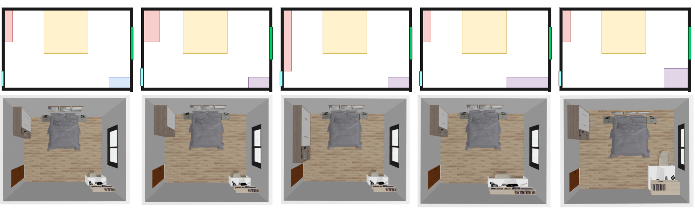
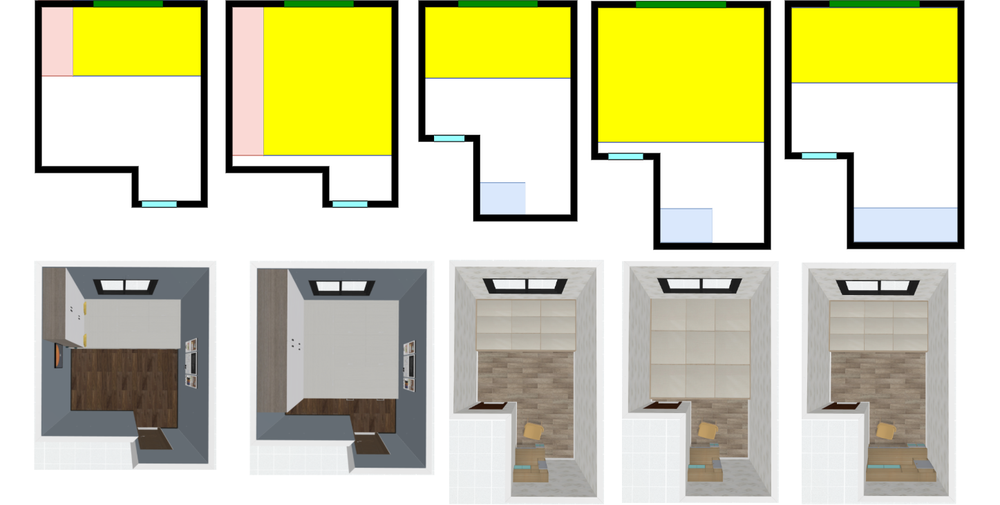
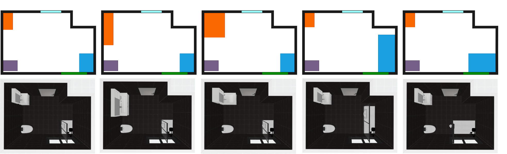
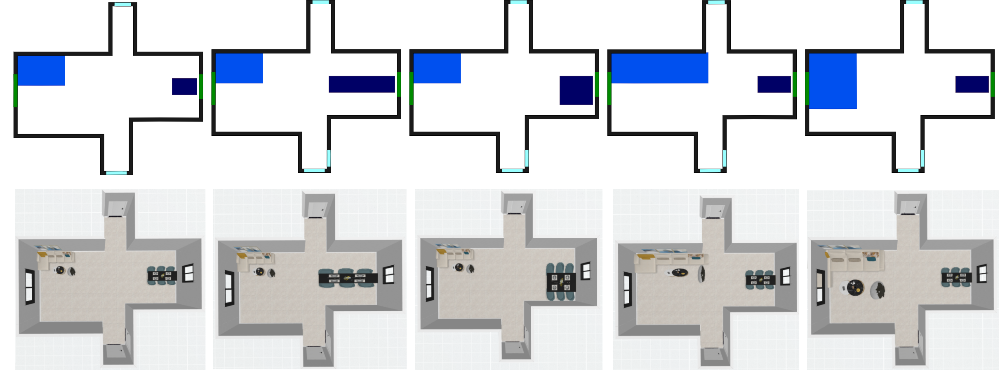
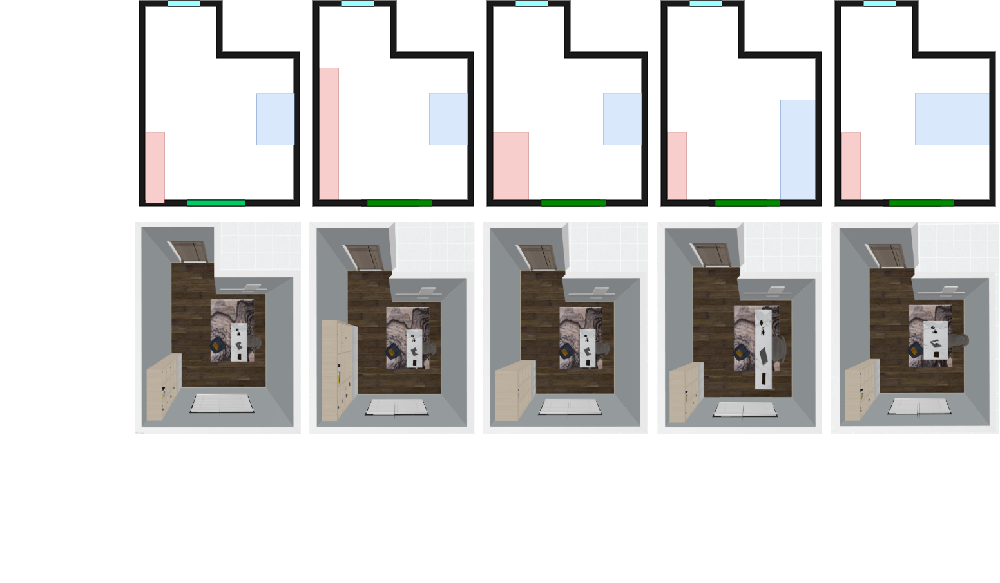
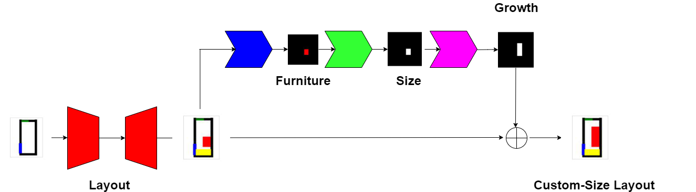

# Layout of Custom-size Furniture Dataset
## Overview
This repository contains the Layout of Custom-size Furniture Dataset (LCSF) of indoor custom-size furniture layouts together with an end-to-end rendering image of the interior layout. This dataset is obtained from designers at the real selling end. In particular, the designs are from 60 professional designers who work with an industry-level virtual tool. Among these designs, many are sold to the proprietors for their interior decorations. We collect these designs at the selling end and provide 710,700 interior layouts. 

Each layout sample contains the categories of the furniture in the room, the position (x, y) and size (height, width, length) of each furniture, and the position (x, y) and size (height, width, length) of the doors, windows, and walls in the room. Besides, the category of the finished furniture and customized furniture is provided. For the customized furniture, the size (height, width, length) is set to the default size in the layout. The sizes of customized furniture are different for different layouts of the same room. 

The dataset contains 200 balcony layouts, 22,000 bedroom layouts, 185,000 kitchen layouts, 400,000 bathroom layouts, 80,000 living-dining room layouts, 1700 study room layouts, and 20,000 tatami room layouts.

## Samples 
### Sample 1
The sizes of custom cabinet and working desk are different for different layouts of the same bedroom room. The size of the customized furniture changes according to the requirements of customers.

### Sample 2
The size of tatami is different for different layouts of the same tatami room. The size of the customized furniture changes according to the requirements of customers.

### Sample 3
The size of bathroom cabinet and bathtub are different for different layouts of the same bathroom. The size of the customized furniture changes according to the requirements of customers.

### Sample 4
The size of dining table and sofa are different for different layouts of the same living-ding-room. The size of the customized furniture changes according to the requirements of customers.

### Sample 5
The size of working desk and bookcase are different for different layouts of the same study room. The size of the customized furniture changes according to the requirements of customers.

### Sample 6
Other samples.

## User Qualification
Only researchers affiliated with a university or a public research institution can apply to use the dataset. Applications from those in a private company, etc. will not be accepted. Usage is limited to academic research purposes only. For more details, please email the IDR office in the contact section below.

## Application
1.Please read the Layout of Custom-size Furniture Dataset Terms of Use，the Handling of LCSF Dataset and the Terms of LCSF Dataset Service carefully and, confirm that they are acceptable to you (and your organization). Fill out the Application Form following the items below: a. An application should be made for each user group such as a laboratory in a university, and the applicant should be a principal investigator in the group, e.g., a professor at a university or a head researcher at a research institution. b.The signer of the Consent Form should be a person authorized to sign the contract on behalf of your organization (typically, a dean of a school or higher for universities). Please consult with your administrative section about the qualified signer beforehand and enter formal information in full for the Signer as to be printed in the Consent Form. c."Research group members" are restricted to the researchers and students belonging to the abovementioned user group and doing research under the supervision of the applicant. If someone belonging to a different organization or a separate laboratory, even in joint research, will use the data, a separate application should be made.

2.Please send the application form as an email attachment to the LCSF dataset office in the contact section. a. The subject of the email should be "Application for the LCSF Dataset (XXXX University)." If the subject is not appropriate, the email may be discarded without its content being reviewed. b.When applying for other datasets at the same time, please send each application as a separate email. c.Please note that your application will be forwarded to LCSF Dataset Co., Ltd. and will be used to judge qualification, prepare the Consent Form, and manage users.d.If a member of your laboratory is working for a specific company and/or if your laboratory has a close connection with a specific company, e.g. doing a joint research project, you may not be granted approval to use the dataset depending on its situation and/or its relation to the research you are going to do using the dataset. The IDR office may approach you for more information if required.

3.Your application will be reviewed at the LCSF dataset office and the availability of the data will be emailed to you. If you do not receive a reply email within a week, please contact the LCSF dataset office.

4.Please submit a Consent Form to Us. The LCSF dataset office will send you a Consent Form by email. The Consent Form should be signed by the signer and PI, and be sent by post to the contact (LCSF dataset office) provided below.

5.The LCSF dataset office will provide the data when your signed Consent Form has been received.

6.The high-resolution layout rendering image data will be provided if LCSF Dataset Co., Ltd. allows it to be used for your purpose. To apply for use, after being provided with the LCSF Dataset, follow the instructions posted on the data download site.

## Data provision
The data will be provided by downloading from the LCSF Dataset Web server.

## Usage report, etc.
You are required to give LCSF Dataset Co., Ltd. notice in advance of any press releases or media interviews regarding research results.Please submit a report on publications at conferences and in journals every year in response to a request from the LCSF DATASET office.Before a private company employee joins the laboratory or your laboratory starts a new collaboration with a private company after signing the Consent Form, please consult with the LCSF dataset office well in advance.

## Application documents
1.[Application Form](https://github.com/CODE-SUBMIT/dataset2/blob/main/application_LCSF_dataset.pdf)

2.[LCSF Dataset Terms of Use](https://github.com/CODE-SUBMIT/dataset2/blob/main/LCSF%20Dataset%20Terms%20of%20Use.pdf)

3.[Handling of LCSF Dataset](https://github.com/CODE-SUBMIT/dataset2/blob/main/Handling%20of%20LCSF%20Dataset%20LCSF%20Dataset%20Co.pdf)

4.[Terms of LCSF Dataset Service](https://github.com/CODE-SUBMIT/dataset2/blob/main/Terms%20of%20LCSF%20Dataset%20Service.pdf)

5.[Consent Form (sample)](https://github.com/CODE-SUBMIT/dataset2/blob/main/consent_lifull_homes_sample.pdf)

## A proposed model architecture for the layout of the custom-size furniture (code and model will be released soon)

## Update information
Overseas distribution began. (2020/11/16)

## Contact email
deepearthgo@gmail.com
